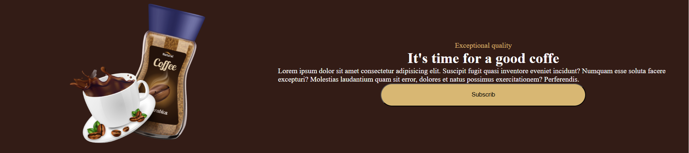
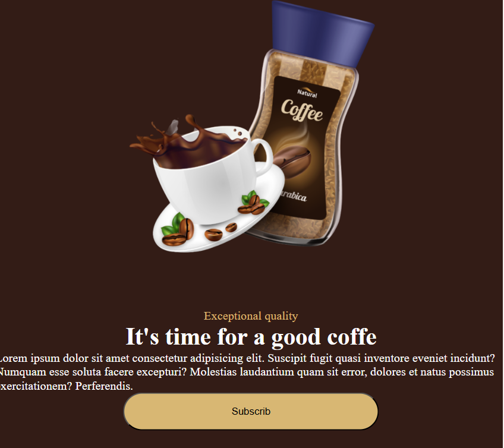

# Coffe_Time a Responsive Web Page Project

This project was created as a homework assignment for the **WBS CODING SCHOOL Full-Stack Software Development course**.

## 📚 Project Objective

The goal of this assignment was to build a **simple and responsive web page** using core web development skills. The exercise was selected from **[Frontend Mentor](https://www.frontendmentor.io/)** — a platform offering real-world UI challenges to improve coding skills.

## 🖼️ Preview

Here’s a preview of the responsive design:

## 💻 Technologies Used

- HTML5
- CSS3
- Responsive Design (Media Queries, Flexbox/Grid)

## 📱 Features

- Fully responsive layout
- Clean and accessible HTML structure
- Mobile-first design approach

## 📁 Project Structure
## 📌 Notes

This is a practice project aimed at improving fundamental front-end development skills. Feedback and suggestions are always welcome!
